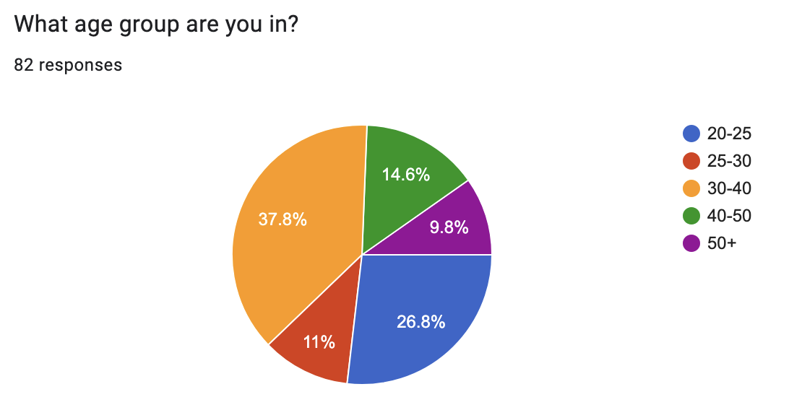
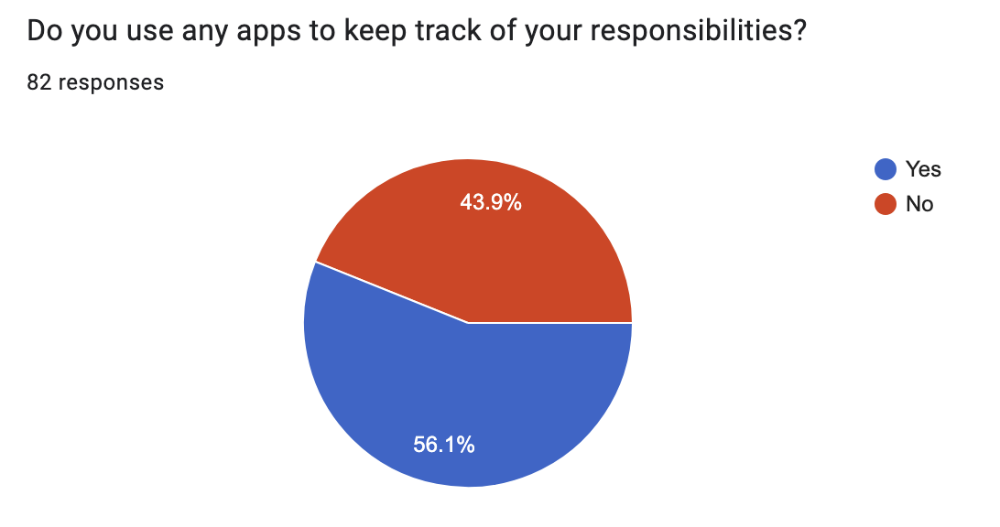
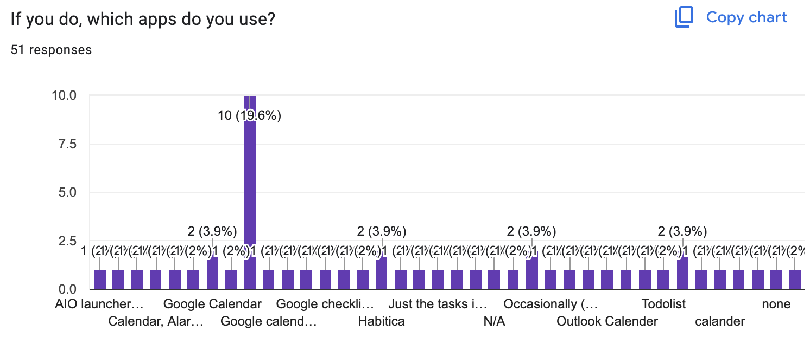
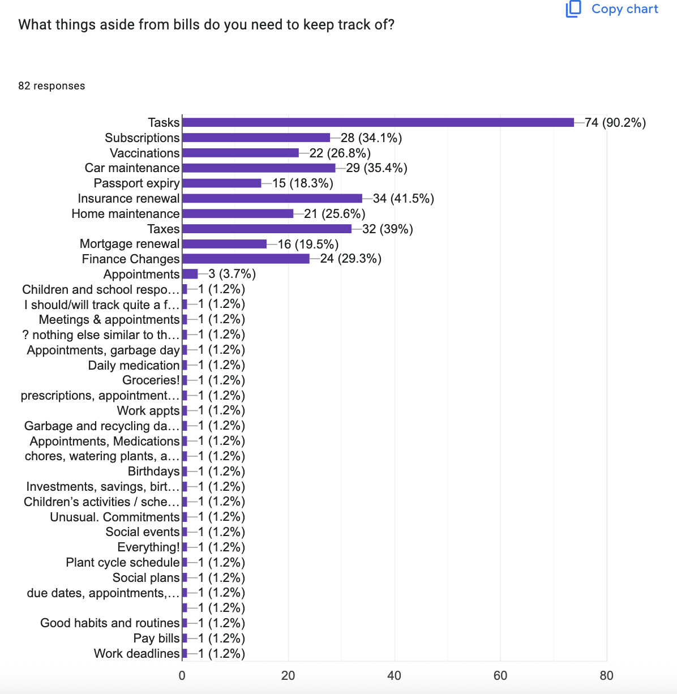
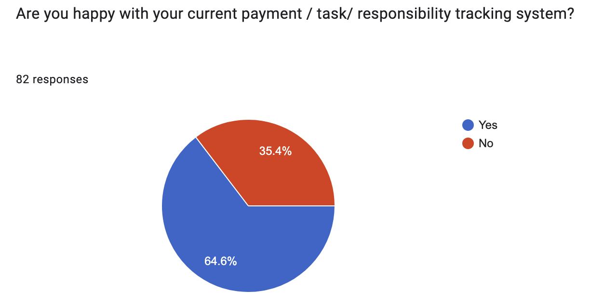
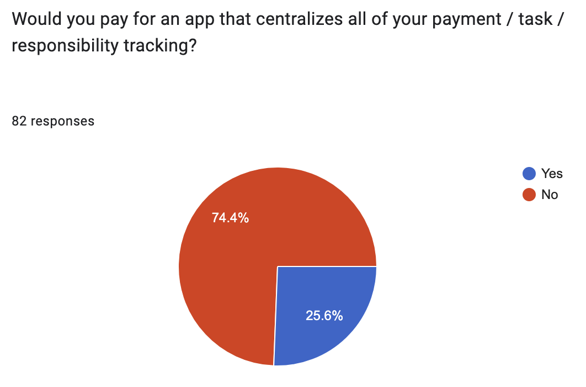

# Customer Discovery Findings

## Interview Findings
# Customer Discovery Takeaways

To get a better understanding of our target customer, we conducted approximately 51 customer interviews and gathered 82 survey responses. The in-person customer interviews were conducted on-campus, so participants were mostly younger university students (between 18 and 30 years old). Doing the survey allowed us to gather responses from a wider range of age groups. We also conducted 3 in-person feature validation interviews using a Figma prototype to gather some early feedback on the design and features being implemented; these were also conducted in-person and at the University of Victoria campus.

## In-Person Customer Interviews

The following are some of the themes that were repeated throughout the in-person interviews.

### Insight 1: Main "tasks" being tracked

We gathered from interviews that the main "adulting" tasks that interviewees reported having to keep track of were the following:

| Category           | % of Interviewees |
|--------------------|-------------------|
| Banking or finances | 40%               |
| Deadlines           | 18%               |
| Rent                | 14%               |
| Car                 | 8%                |
| Groceries           | 8%                |
| Insurance           | 6%                |
| Health              | 4%                |
| Subscriptions       | 4%                |

This implies that we may need to place a bigger focus and develop features that focus on personal finances.

### Insight 2: Need for centralization

We heard that people felt overwhelmed by the fact that they needed multiple apps to keep track of their lives or that they found their current app solutions to be inefficient. However, people that were happy with their current solutions said they were unlikely to switch, especially those that like organizing their life on paper. This indicates that we should focus on people that already use applications as their current solution but that would like a centralized application rather than using multiple apps.

### Insight 3: Type B personality

Several interviewees who showed enthusiasm for our idea also described themselves as somewhat disorganized. One participant even remarked, "My mom says I should be more organized." This suggests that our target customers may be individuals who recognize their own lack of structure or forgetfulness and are motivated to find tools that help them stay on track.

### Insight 4: Intuitive Design & Usability

Interviewees reported that they would only use an app like "OnTrack" if it was "very easy to use." Furthermore, they said that they would only pay for it if it was well-designed.

### Insight 5: Monetization

Interviewees were open to a lifetime subscription, and when asked how much they would pay the responses varied between $10 and $50. One interviewee said they would prefer a yearly subscription, for which they would be willing to pay $5.

### Insight 6: Calendar Synchronization

When asked for any features that they would like to see in our app, several interviewees said they would find it helpful if it integrated with their current calendar application (Google Calendars, Apple Calendars, etc.).

### Insight 7: Satisfaction with Current Solution

56.8% of interviewees were unsatisfied or mixed about their current solutions.

## Survey Findings

The main takeaways we gathered from the survey are as follows:

- Approximately 80% of people use a calendar to keep track of their tasks.
- The main things people needed to keep track of were general tasks (90%), insurance renewals (41%), taxes (39%), car maintenance (35%), and subscriptions (34%).
- 25.6% of people answered "Yes" when asked if they would pay for an app that centralized their responsibilities tracking.
- 35% of respondents were unhappy with their current tracking system.

We were interested in determining which age group would be more likely to pay; the following table indicates how many responders out of each age group answered "Yes" when asked if they would pay for an app that centralized their responsibilities tracking.

| Age Group | Yes/People in Age Category | Yes % within Age Category |
|-----------|-----------------------------|----------------------------|
| 20–25     | 4/22                        | 18%                        |
| 25–30     | 3/9                         | 33%                        |
| 30–40     | 9/31                        | 30%                        |
| 40–50     | 2/12                        | 16%                        |
| 50+       | 3/8                         | 37%                        |

While the age categories of 25–30, 30–40, and 50+ had the highest relative percentages, the sample sizes for 25–30 and 50+ are too small to confidently establish that these may be good age ranges for our target market. However, the 30–40 age range category had a much larger sample size and still reported a relatively high percentage of people that would pay for an app like "OnTrack."

## Feature Validation Interviews

The feature validation interviews were informal; we mostly allowed interviewees to explore the prototype without any instructions while we observed.

### Desired Features

- Syncing with Google Calendar
- Subscription renewals should update their renewal dates automatically
- Customizing color scheme
- A way to add tasks verbally (e.g., through Siri)
- Localized suggestions (e.g., processing times for passport renewals may be different)
- Being able to customize how early each suggestion shows up
- Indication that tasks are due soon (especially tasks within a day)

### Enjoyed Features

- Prescription refill reminders
- Being able to see completed tasks
- Having a separate Reminders tab in the navigation bar

We observed that no interviewee realized that they could use the Calendar button to get a calendar view of their upcoming tasks. We realized that the icon may not appear functional, and so we need to make it more apparent that it is a button.

## Screenshots from Survey Findings

