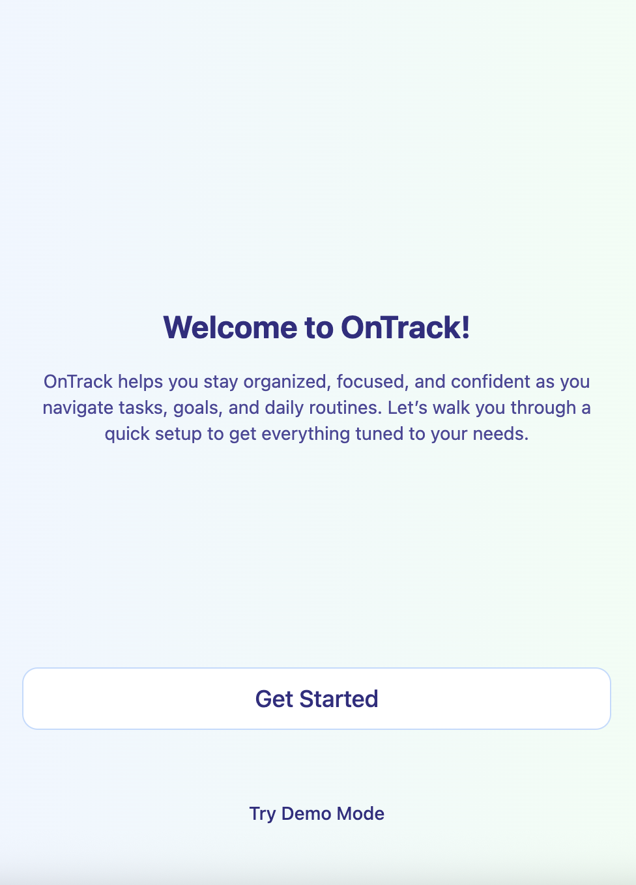
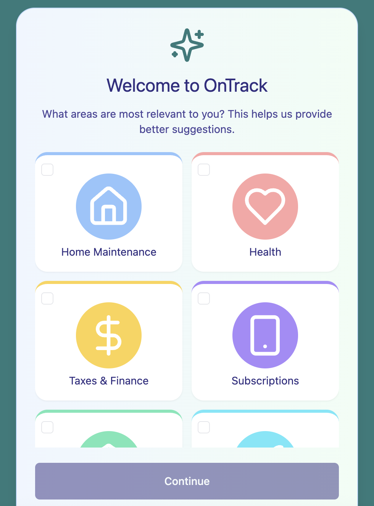
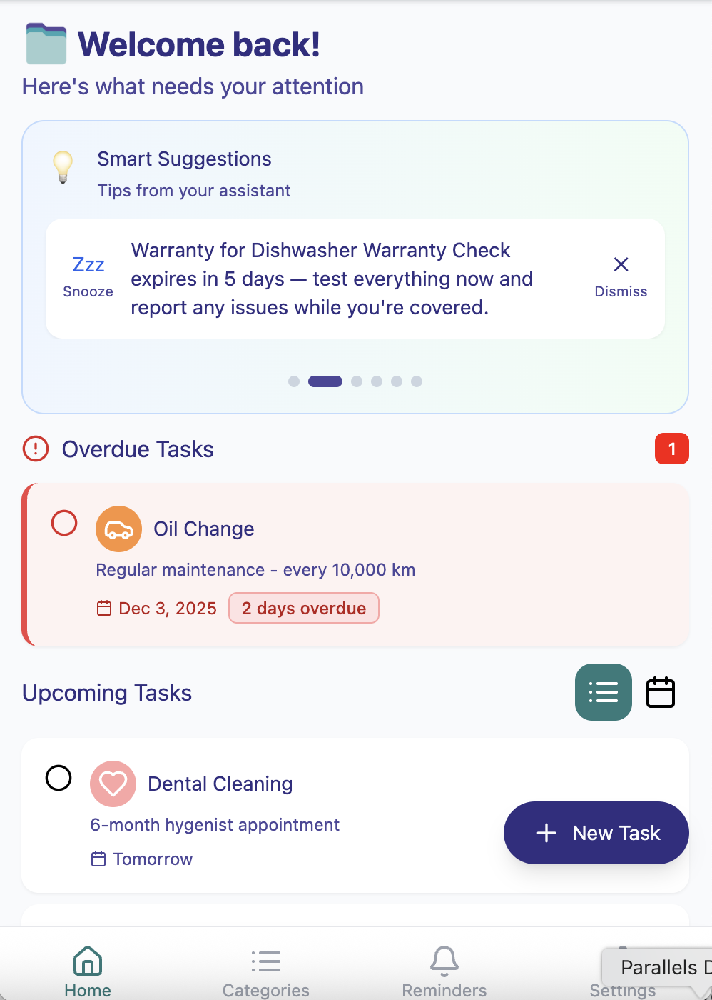
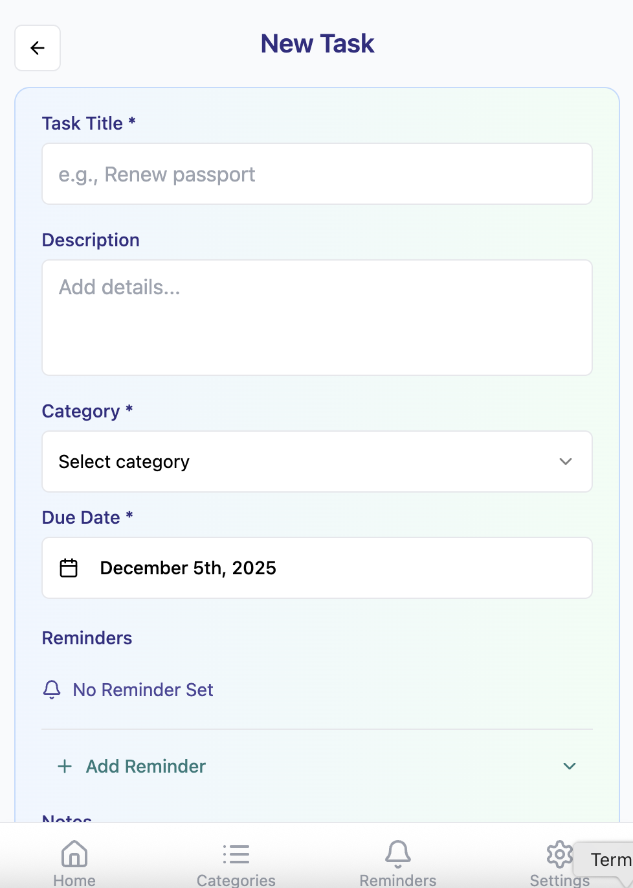
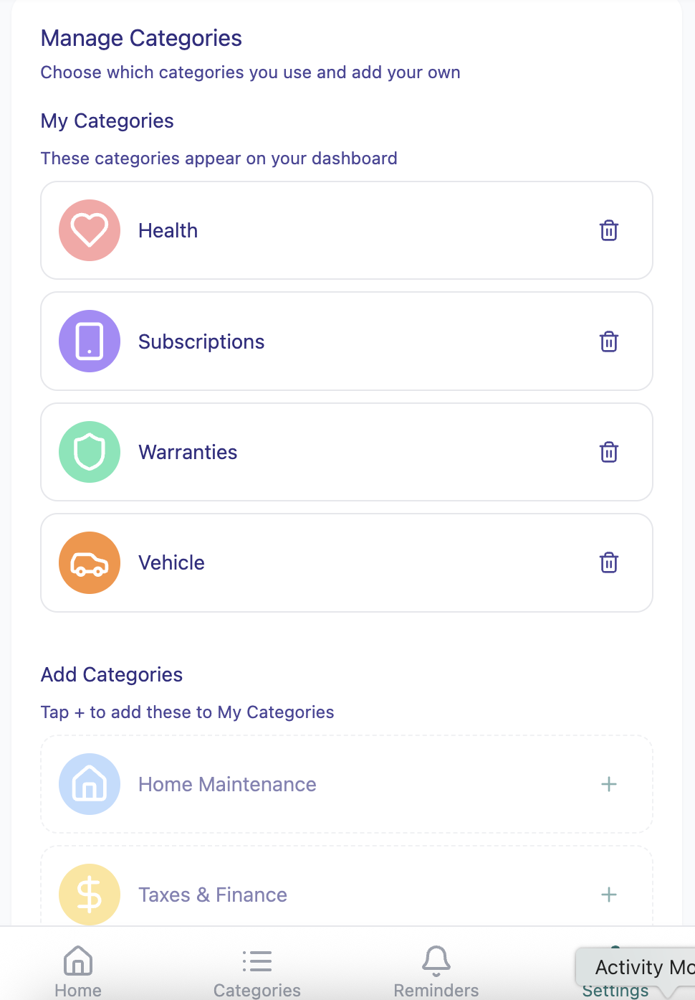
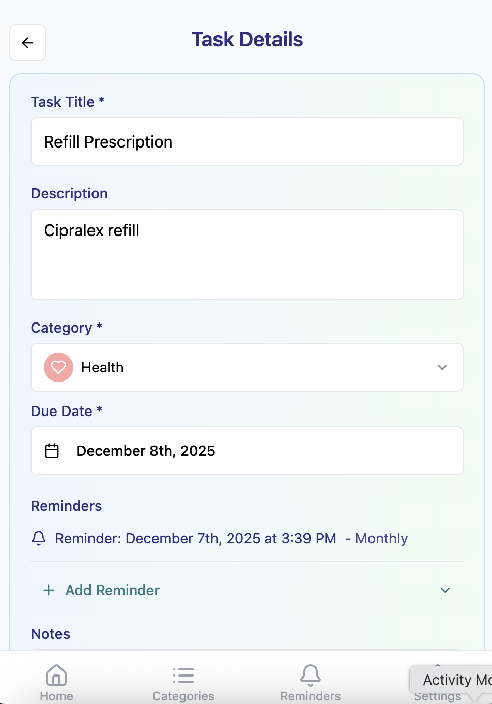
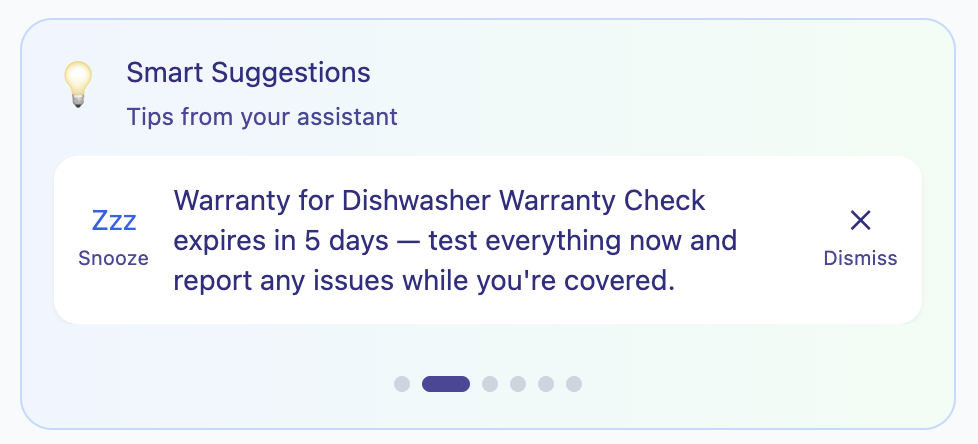

# End User Flow

This page outlines the **OnTrack** user journey — from the first app interaction to organizing life’s essential tasks.  
It includes key screens, navigation details, and short descriptions of each stage.

---
## 1. Welcome Screen and Onboarding

Users are greeted with a **Welcome Screen** that has a brief explanation of the app's purpose. On the **Onboarding Screen**, they can choose what categories they'd like to keep track of.

**Flow highlights:**
- Quick, easy selection of categories that should be familiar if they've used other apps (like Spotify)
- Only a few buttons to get started, so that users don't feel overwhelmed

**Screenshot:**

## 2. Dashboard Overview

Users land on the **Dashboard**, which displays all upcoming tasks in a clean, visual layout. Tasks are grouped by category and sorted by urgency.

**Flow highlights:**
- Centralized view of all upcoming responsibilities
- Color-coded categories for quick scanning
- Option to filter by category or due date

**Screenshot:**  

---

## 3. Task Creation

Users can tap the “Add Task” button to create a new task. They can enter a title, description, due date, and assign it to a category. Users can also upload relevant documents and set multiple reminders.

**Flow highlights:**
- Add task title, description, and due date
- Assign task to a category or create a new one
- Upload files (e.g., receipts, warranties, forms)
- Set multiple reminders (e.g., 1 week before, day of)

**Screenshot:**  

---

## 4. Category Management

Users can manage their categories from the settings or task creation screen. They can create new categories, rename existing ones, or delete unused ones.

**Flow highlights:**
- Create and customize categories
- Assign tasks to categories for better organization
- Delete or edit categories as needed

**Screenshot:**  

---

## 5. Task Details & Reminders

Tapping on a task opens a detailed view where users can see all associated information, including attached documents, reminder schedule, and category tags.

**Flow highlights:**
- View task details and attached files
- Edit reminders and due dates
- Track completion status

**Screenshot:**  

## 6. Smart Assistant Prompts

As users add tasks, the **OnTrack Assistant** analyzes their entries and offers helpful suggestions based on context. These prompts appear in the dashboard or task detail view and help users stay ahead of deadlines and requirements they might not think to track.

**Flow highlights:**
- Context-aware suggestions based on task content (e.g., travel, health, home)
- Educational tips and best practices (e.g., how long it takes to renew a passport)
- Prompts to add related tasks or documents (e.g., check insurance before travel)
- Visual indicators or assistant cards that appear inline with the task list

**Example Scenario:**
- User adds a task: “Trip to Japan – March 15”
- Assistant prompt appears:  
  “Heads up! Japan requires your passport to be valid for at least 6 months beyond your arrival date. It typically takes 1 month to renew a passport — want to add a reminder to check your expiry?”

**Screenshot:**  

---

## Summary

The **OnTrack** user flow emphasizes:
- Centralization of life’s essential tasks  
- Visual organization and customization  
- Reliable reminders and document storage  

By combining smart task management with personalized categories and contextual guidance, OnTrack helps users stay organized and confident — no matter what life throws at them.
